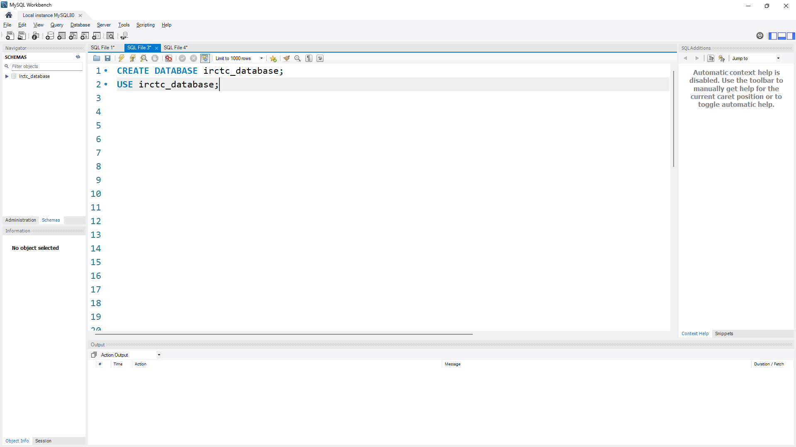

# Railway Management System

This project is a **Railway Management System** that simulates the core functionalities of the IRCTC system. The system enables users to:

- Book train tickets
- Check train availability
- Update train details
- Implement role-based access for both users and administrators

The backend is developed using **Node.js**, **Express.js**, and **MySQL** to ensure efficient and scalable performance.

---

## Project Setup

### Prerequisites

To run this project, ensure you have the following installed:

- [Node.js](https://nodejs.org/en/) (v14 or later)
- [MySQL](https://www.mysql.com/) (Database setup)
- [Postman](https://www.postman.com/) (for API testing)

### Environment Variables

You need to create a `.env` file in the root of your project with the following environment variables:

```bash
PORT=3000
DB_HOST=localhost
DB_USER=root
DB_PASSWORD=Kunal3110kk
DB_NAME=irctc_database
JWT_SECRET=Kunal_WorkIndia_Assignment
```

### Installation

1. Clone the repository to your local machine:
   ```bash

      git clone https://github.com/kunaldoliya90/WorkIndia_Assignment_NodeJS
      cd WorkIndia_Task_RailwayManagement
   ```
2. Install all necessary dependencies using npm:

   ```bash
    npm install
   ```

3. Set up your MySQL database:

- Create a MySQL database named irctc_database.
- Run the SQL scripts in database/schema.sql to create necessary tables (users, trains, bookings).

Example:

```bash

CREATE DATABASE irctc_database;
USE irctc_database;

CREATE TABLE users (
   id INT AUTO_INCREMENT PRIMARY KEY,
   name VARCHAR(255) NOT NULL,
   email VARCHAR(255) UNIQUE NOT NULL,
   password VARCHAR(255) NOT NULL,
   role ENUM('user', 'admin') DEFAULT 'user',
   created_at TIMESTAMP DEFAULT CURRENT_TIMESTAMP
);

CREATE TABLE trains (
   id INT AUTO_INCREMENT PRIMARY KEY,
   train_number VARCHAR(50) NOT NULL,
   source VARCHAR(255) NOT NULL,
   destination VARCHAR(255) NOT NULL,
   total_seats INT NOT NULL,
   available_seats INT NOT NULL,
   created_at TIMESTAMP DEFAULT CURRENT_TIMESTAMP
);

CREATE TABLE bookings (
   id INT AUTO_INCREMENT PRIMARY KEY,
   user_id INT,
   train_id INT,
   seats INT NOT NULL,
   FOREIGN KEY (user_id) REFERENCES users(id),
   FOREIGN KEY (train_id) REFERENCES trains(id)
);

```

### Starting the Server

Once the setup is complete, start the server using npm:

```bash

  node index.js

```


#### Note :- By default, the server will run on port 3000. You can access the API at http://localhost:3000.

### API Endpoints

#### User Routes

    1. Register a new user
       * HTTP Method :- POST
       * Endpoint :- http://localhost:3000/user/register
       * Body:

```bash
{
  "name": "Kunal Doliya",
  "email": "kunaldoliya.ofcj@gmail.com",
  "password": "Kunal1234"
}

```

2. Login
   - HTTP Method :- POST
   - Endpoint :- http://localhost:3000/user/login
   - Body:

```bash
    {
  "email": "kunaldoliya.ofcj@gmail.com",
  "password": "Kunal1234"
    }
```

3. Check train availability

   - HTTP Method :- GET
   - Endpoint :- http://localhost:3000/user/availability?source=Ranchi&destination=Delhi
   - Query Parameters
     - source: Source station (e.g., "Sadalpur")
     - destination: Destination station (e.g., "Delhi")
   - Response:

```bash
{
  "available": true,
  "availableTrainCount": 1,
  "trains": [
    {
      "trainNumber": "123123",
      "availableSeats": 600
    }
  ]
}

```

4.  Book Seats
    - HTTP Method :- POST
    - Endpoint :- http://localhost:3000/user/book
    - Request Body:

```bash
  {
  "trainId": 1,
  "seatsToBook": 2
}

```

- Response:

```bash
{
  "message": "Seats booked successfully"
}
```

Note :- Requires JWT authentication.

5.  Booking Details

    - HTTP Method :- GET
    - Endpoint :- http://localhost:3000/user/getAllbookings

    - Response:

```bash
[
    {
        "booking_id": 17,
        "number_of_seats": 50,
        "train_number": "123123",
        "source": "Sadalpur",
        "destination": "Delhi"
    }
]


```

#### Admin Routes

1.  Add a new train

    - HTTP Method :- POST
    - Endpoint :- http://localhost:3000/admin/addTrain

    - Request Body:

```bash
{
    "message": "Trains added successfully",
    "trainIds": [
        {
            "trainNumber": "172622",
            "trainId": 21
        }
    ]
  }
```

         * Headers :
             * x-api-key: Your admin API key which is stored in .env

2. Update seat availability

   - HTTP Method :- PUT
   - Endpoint :- http://localhost:3000/admin/update-seats/10
   - Request Body:

```bash
 {
  "totalSeats": 200,
  "availableSeats": 150
 }
```

       * Response:

```bash
{
  "message": "Seats updated successfully"
}
```

        * Headers:
            * x-api-key:  Your admin API key which is stored in .env

### Running Tests

You can test all the available APIs using Postman. The endpoints are well-structured and follow RESTful conventions.

```bash
[
  {
    "trainNumber": "101010",
    "source": "Mumbai",
    "destination": "Pune",
    "totalSeats": 200
  },
  {
    "trainNumber": "102020",
    "source": "Chennai",
    "destination": "Bangalore",
    "totalSeats": 250
  },
  {
    "trainNumber": "103030",
    "source": "Kolkata",
    "destination": "Patna",
    "totalSeats": 300
  },
  {
    "trainNumber": "104040",
    "source": "Jaipur",
    "destination": "Agra",
    "totalSeats": 150
  },
  {
    "trainNumber": "105050",
    "source": "Hyderabad",
    "destination": "Visakhapatnam",
    "totalSeats": 350
  }
]

```

### Technologies Utilized

- **MySQL**: Relational database used for storing user information, train schedules, and booking data.
- **Node.js**: Backend runtime environment enabling the server-side logic and API management.
- **Express.js**: A lightweight framework that facilitates the creation of the RESTful API.
- **JWT (JSON Web Token)**: For secure user authentication and authorization processes.
- **bcrypt**: Encryption library used for securely hashing user passwords.
- **dotenv**: Manages environment variables for secure configuration and deployment.


# photos of the project

### Screenshots of the Project

#### 1. Database Creation



Description: This screenshot showcases the creation of the database schema for the Railway Management system.

---


#### 2. Checking Train Availability


Description: This screenshot demonstrates how the `GET /user/availability` API is used to check train availability.

---

#### 3. Server Running Locally


Description: The server running locally on `http://localhost:3000` as part of the project setup.

---

#### 4. User Login via Postman


Description: A Postman request to log in a user, showcasing how the login API works.

---

#### 5. User Registration via Postman


Description: A Postman request to register a new user, demonstrating the registration functionality.

---

#### 6. User Database


Description: The structure and data stored in the `users` table of the `irctc_db` database.

---

#### 7. Workbench SQL View


Description: An overview of the SQL queries and table structures in MySQL Workbench.
